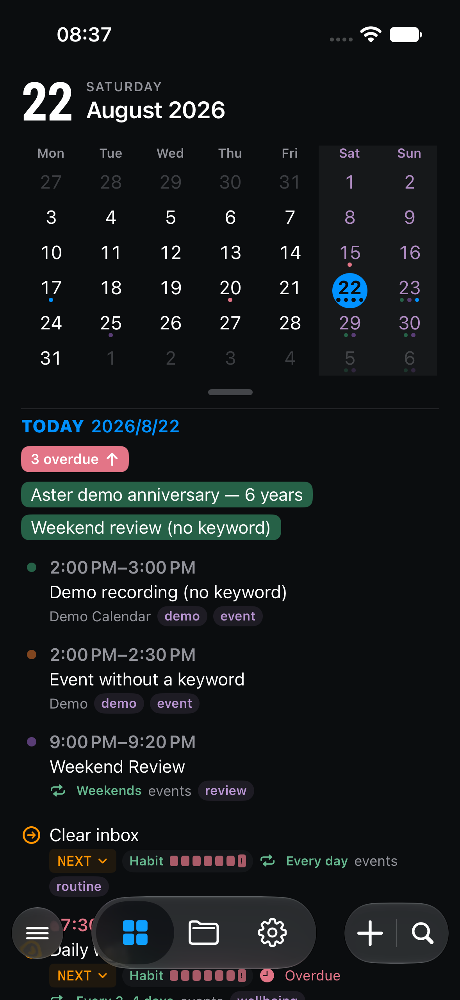
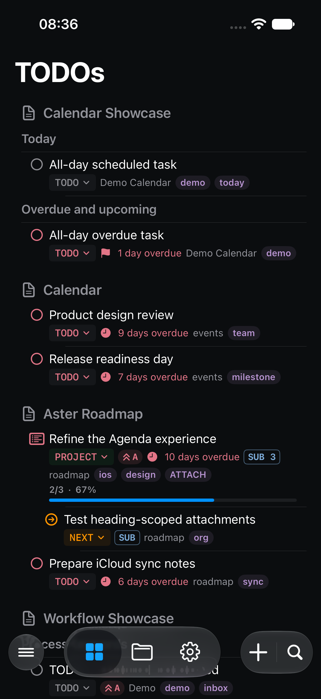
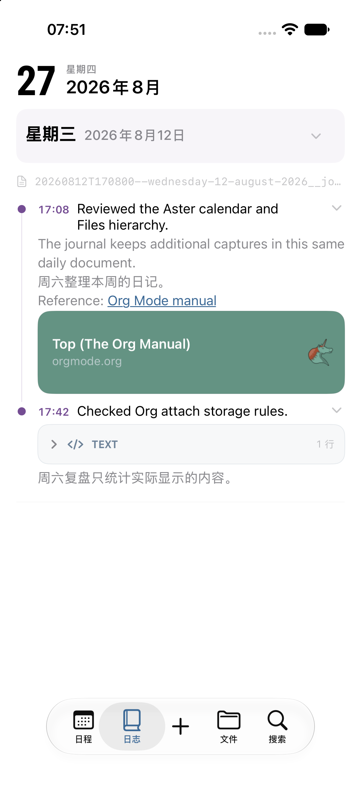
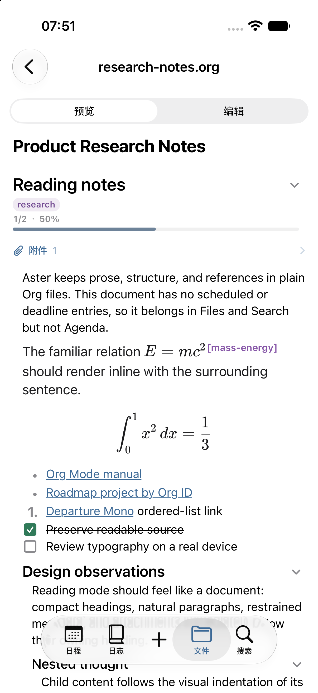

🌐 <a href="README.md">简体中文</a> · <strong>English</strong>

<h1 align="center">Aster Documentation & Feedback</h1>

A native Org mode workspace for Apple and Android devices

Aster is a native Org mode workspace for iPhone, iPad, Android phones, and Android tablets. It presents your existing `.org` files as an agenda, task list, journal, file browser, global search, reminders, and widgets—while keeping the original Org files and adjacent Org Attach directories as the source of truth.

The iOS/iPadOS documentation and screenshots use 0.1 (11), dated 5 September 2026, as their TestFlight baseline. Android documentation remains at 0.1 (9); its build is being prepared for Google Play testing and is not publicly available yet.

Shared Org semantics stay aligned, while system integrations and adaptive UI are documented per platform. Unreleased fixes are explicitly labeled and are not included in those versions.

This repository serves two purposes:

- Provide English and Chinese documentation aligned with current iOS/iPadOS and Android test behavior.
- Collect reproducible bugs, compatibility reports, and feature requests in one public place.

> Aster is still in beta. Before testing with important data, back up both your Org files and every adjacent `data/` attachment directory.

## Start Here

1. [Platforms and Differences](docs/en/platforms.md): release status, system requirements, navigation, cloud providers, notifications, and system integrations.
2. [Quick Start](docs/en/quick-start.md): connect a workspace and configure Agenda, Journal, and Capture.
3. [How Org Source Appears in Aster](docs/en/org-and-aster.md): classification and copyable examples for Events, Tasks, Projects, Habits, Notes, and Containers.
4. [Agenda and TODOs](docs/en/agenda-todos.md): dates, times, overdue behavior, repeaters, and reminders.
5. [Journal and Journal Entry Templates](docs/en/journal-capture.md): fixed calendar, daily files, templates, media, and write-back rules.
6. [Files, Preview, Editing, and Attachments](docs/en/files-preview-attachments.md): native document reading, source editing, and Org Attach.
7. [Workflow, Project, Habit, and Perspective](docs/en/workflow-project-habit-perspective.md): custom keywords, project progress, habits, optional Projects/Anniversaries templates, and saved views.
8. [Sync, Data Safety, and Conflicts](docs/en/sync-and-safety.md): supported cloud providers and backup guidance for each platform.
9. [Submit Feedback](docs/en/feedback.md): provide platform, version, and reproduction details without exposing private data.

## Four Principles to Know

### Org files are authoritative

Aster does not migrate tasks into a proprietary database. Agenda, TODOs, Journal, Search, widgets, and local notifications are derived from real Org files, and supported edits are written back to those files.

### Org semantics determine item type

Aster does not infer type from a filename or one hard-coded English keyword. Classification depends on whether a Workflow keyword exists, whether a timestamp contains a clock time, whether `STYLE=habit` is present, and whether a Workflow keyword is configured as a Project.

### Unsupported text should survive unchanged

Aster modifies only the fields or source ranges owned by the current operation. Unknown properties, drawers, source blocks, comments, and other Org syntax should not be regenerated merely because a state or date was edited.

### Sync is not backup

Cloud sync propagates deletions and conflict resolutions as well as correct edits. Keep an independent backup, including the `data/` directories next to Org files that use Org Attach.

## Current iOS/iPadOS UI Examples

These screenshots come from the iOS/iPadOS build's anonymous built-in Demo Workspace. They use the same kinds of Org data shown in this documentation. Android uses the same Org projections and task logic with Android-native navigation and adaptive components; these iOS screenshots are not presented as Android device results.

| Agenda | TODOs |
| --- | --- |
|  |  |

| Journal | Org Preview |
| --- | --- |
|  |  |

## Feedback

- For bugs, crashes, rendering problems, or incorrect write-back, open a [Bug report](https://github.com/LuciusChen/aster-feedback/issues/new?template=bug-en.yml).
- To discuss a new use case or interaction improvement, open a [Feature request](https://github.com/LuciusChen/aster-feedback/issues/new?template=feature-en.yml).
- Do not post credentials, private file contents, or unreleased data in a public issue. Use a minimal redacted Org example and remove account names, paths, tokens, document text, and attachments.

## Documentation Scope

These pages use the current test releases as their baseline. Implemented but unreleased changes are explicitly labeled with their platform and release status; design ideas are not presented as shipped features. When the UI or Org write-back rules change, the corresponding examples and screenshots should change with them.
